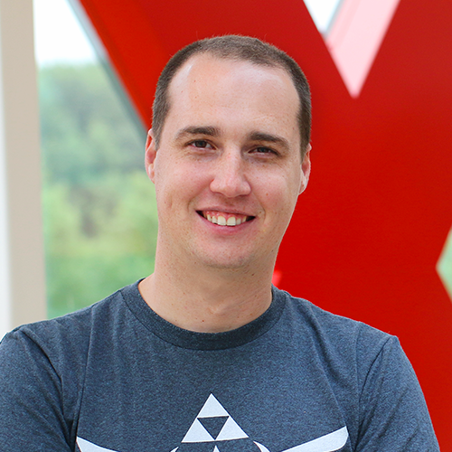

<h1 align="center">Vincent Lesierse</h1>

Roerdompweg 55 • 3263 AJ, Oud-Beijerland, The Netherlands 
vincent@lesierse.com • +31 6 52797520 
blog.lesierse.com • github.com/vlesierse • vlesierse.twitter.com • linkedin.com/in/vlesierse

As a principle software architect and technology enthusiast I'm with my head in the cloud and love to code. I started out with a pasion for software engineering, but grew over years into the cloud where I love the challenges of scale and the dynamics of running software for a large set of users. I like to cover the full stack of the application. Think about composing the UI and allow the customer to have the best experience possible, communicate in a resilient and same maner or make sure the data is stored and retrieved efficiently.

Most of my time I've designed and developed framework components on .NET. As fun that it is, I like to be practical as well to bring value for the customer. As a developer and architect I believe you should continuously broaden your horizon and try out various technologies, patterns and practices.

## Professional Experience
*   **Jan. 2012 - Present**  
    **Exact** *(Fulltime)*  
    ***Principal Software Architect***

    Rejoining Exact gave me the possibility to improve a product and its architecture which existed since early 2000. Exact Online is a cloud product with allows small and medium businesses to do their day to day work. With more than 400.000 companies it's the market leader of cloud business software in the Netherlands.

    As a member of the Exact Online system team we have the responsibility to provide, improve and maintain the development platform for the solution teams. We made it possible to scale out the databases underneath and introduced ASP.NET MVC with Dependency Injection to support the teams in adopting domain driven design.

    Because of the monolith characteristics of the product we encounter all kind of challenges regards scaling and maintainability of the product. For this reason, I started to microservices adventure with the goal to break down the monolith in smaller pieces and adopt DevOps principals and containers to the teams to enable continuous deployment. This way we can shorten the cycle to go from code to production.

    Because breaking this monolith will take a while, we do need to improvements to the monolith as well. For better scalability, cost optimization and innovation we decided to move the monolith in the public cloud. After the implementation of a successful proof of concept we have chosen Amazon Web Services as our cloud and I lead the Infra & Operations team from a technical point of view to AWS using automation.

    Next to this I'm also a member of the Architecture Governance Board and actively guiding other teams and helping them to make the right decisions.

*   **May. 2009 - Dec. 2013**  
    **Wheel Seven**  
    ***Owner***

    Wheel Seven is a cooperation between friends to launch mobile applications and games to the market.
    * **DQFS**: An internal application for providing quality report in the fruit & vegetables market using .NET and Windows Mobile. 
    * **Klaverjasblok**: A score keeping application for the card game Klaverjassen. It's written for iOS and launched to the App Store. 
    * **Ace31**: A card game for iOS written using the Cocos2D game engine.

*   **Jan. 2010 - Dec. 2011**  
    **Multicard** *(Fulltime)*  
    ***Senior Software Engineer***

    Multicard was expanding their business into the payment solutions I've designed and implemented the front-end application for the customers to active and interact with their online wallet as well as the backend used for the cash registers to do their payments. We have done succesful implementations with local sport clubs and a proof of concept with the Albert Heijn. I've worked closely with the Rabobank which provided the payment services.

    Another project I worked on was a mobile check-in unit for public transportation companies. It was a Android application which interacts with the cards to enable passengers to check-in and out.

*   **May 2004 - Dec. 2009**  
    **Exact** *(Fulltime)*  
    ***Senior Software Engineer***

    At Exact I grew from junior software engineer to senior research engineer in 5 years. Started out with writing a XML Import/Export components and migrating the Synergy runtime from ASP to ASP.NET. This included the technical aspect as well as transfering the project to our development center in Malaysia which means providing training and offer technical support. Over the year I grew more in a research role and was part of a team responsible for setting the direction for future application development within Exact.

    We developed a service-oriented architecture with modern technologies, patterns and practices for which I build foundation in terms of security and communication. Also at the front end I did a lot work build a composable UI library to enable rapid development. For this architecture raised the Exact Identity Service. I developed the foundation of its authentication scheme which is based on federated authentication allowing Exact and partners to implement Single Sign On.

*   **Sept 2003 - May 2004**  
    **Dimension Interactive**  
    ***Owner***

    After graduation and the poor market for beginning IT professionals I started my own business for gaining experience in the field. Worked on projects for various companies like creating web sites, web applications, setting up and maintaining IT infrastructure.

*   **Sept. 2001 - May 2004**  
    **Tchai Multimedia** *(Internship, Partime)*  
    ***Software Engineer***

    Responsible for designing and implementing multimedia based applications like interactive kiosks and information screens for instore communication purposes.

## Education
*   **2003 - 2004**  
    **Master Business Administration**, Erasmus University (Rotterdam)

*   **1999 - 2003** *(Diploma)*  
    **Bachelor of Information and Communication Technology**, Rotterdam University of Professional Education

*   **1995 - 1999** *(Diploma)*  
    **High School**, Willem van Oranje (Oud-Beijerland)  
    *Dutch, English, Math, Physics, Chemistry and Business Studies*

*   **1994 - 1995**  
    **High School**, Juliana MAVO (Rotterdam)

## Additional Skills
**Languages**
|             |                                       |              |
|-------------|---------------------------------------|-------------:|
| Dutch       | Hallo Wereld                          | Native       |
| English     | Hello World                           | Fluent       |
|             |                                       |              |
| C#          | `Console.PrintLine("Hello World");`   | Fluent       |
| JavaScript  | `console.log("Hello World");`         | Fluent       |
| Python      | `print("Hello World")`                | Intermediate |
| Ruby        | `puts 'Hello world'`                  | Intermediate |
| Objective-C | `NSLog(@"Hello world");`              | Intermediate |
| Swift       | `print('Hello world')`                | Intermediate |
| Java        | `System.out.println("Hello, World");` | Rusty        |
|             |                                       |              |
| Bash        | `echo 'Hello world'`                  | Intermediate |
| PowerShell  | `Write-Host 'Hello world'`            | Intermediate |

**Computer Science**
|                   |                                                                         |
|-------------------|------------------------------------------------------------------------:|
| Clouds            | Amazon Web Services, Microsoft Azure, Google Cloud, Digital Ocean       |
| Devices           | Mac, PC, Raspberry Pi, Netduino, AWS DeepLens                           |
| Operating Systems | Linux (Ubuntu, Debian), MacOS, iOS, Android, Windows (Server)           |
| DevOps            | Docker, Kubernetes, AWS ECS, Terraform, Chef                            |
| Source Management | GitHub, Team Foundation Server, Visual Studio Team Services             |
| CI/CD             | Jenkins, Team Foundation Server, Visual Studio Team Services, AWS Code* |
| Applications      | ASP.NET (Core), NodeJS, Xamarin, AWS Lambda, Service Fabric, Akka.NET   |
| Frontend          | HTML/CSS/JS, React, Angular, jQuery                                     |
| Storage           | SQL Server, MySQL, MongoDB, Elasticsearch, AWS DynamoDB, Azure CosmoDB  |
| Big Data & AI     | AWS Glue, AWS Sagemaker                                                 |
| Messaging         | RabbitMQ, Azure Service Bus, AWS SNS/SQS/Kinesis                        |
| IDE               | Visual Studio Code, Visual Studio, XCode                                |
 
**Certifications**
*   **AWS Certified Solutions Architect - Associate**

## Hobbies

*   **Programming**
*   **Formula 1**
*   **Snowboarding**
*   **Diving**
*   **Golf**